# Terraform AWS Three-Tier Architecture

A hands-on Terraform project that provisions a three-tier architecture
on AWS using reusable Terraform modules.

The infrastructure is divided into:

-   Web tier --- Public subnet with a public EC2 instance
-   Application tier --- Private subnet with an EC2 instance without a
    public IP
-   Database tier --- Private subnets with Amazon RDS for MySQL
-   Network layer --- VPC, Internet Gateway, route tables, NAT Gateway,
    and Elastic IP
-   Security layer --- Separate security groups for Web, Application,
    and Database tiers

This project was created as a practical learning project to understand
AWS networking, Terraform modules, security groups, private/public
subnets, NAT Gateway routing, EC2, and RDS.

## Architecture


### Architecture Overview

The infrastructure is organized into three tiers:

-   **Web Tier:** Public EC2 instance deployed in a public subnet.
-   **Application Tier:** Private EC2 instance without a public IP.
-   **Database Tier:** Amazon RDS for MySQL deployed using two private
    database subnets.
-   **Network Layer:** VPC, Internet Gateway, NAT Gateway, route tables,
    and Elastic IP.
-   **Security Layer:** Separate security groups control communication
    between the Web, Application, and Database tiers.

The Application tier uses the NAT Gateway for outbound internet access
without being directly exposed to the internet.

## Design Decisions

-   The Web tier is placed in a public subnet to accept internet
    traffic.
-   The Application tier is placed in a private subnet without a public
    IP.
-   The Database tier is kept private and is not publicly accessible.
-   Security groups restrict communication between the different tiers.
-   The NAT Gateway provides outbound internet access for the private
    Application tier.
-   The database uses two private subnets for the RDS subnet group.
-   Terraform modules separate the VPC, Web, Application, and Database
    infrastructure.

## Traffic Flow

Internet traffic reaches the Web tier through the Internet Gateway.

The Web EC2 instance is deployed in a public subnet and has a public IP.

Application traffic is allowed from the Web security group to the App
security group on TCP port 8080.

The App EC2 instance is deployed in a private subnet and does not have a
public IP.

Database traffic is allowed from the App security group to the DB
security group on TCP port 3306.

RDS MySQL is deployed privately using two database subnets.

The App subnet uses the NAT Gateway for outbound internet access without
exposing the App EC2 instance directly to the internet.

## AWS Resources

This project provisions the following major AWS resources:

-   VPC with CIDR `10.0.0.0/16`
-   Internet Gateway
-   4 subnets across multiple Availability Zones
-   1 public Web subnet
-   1 private App subnet
-   2 private DB subnets
-   Public route table
-   Private App route table
-   Private DB route table
-   NAT Gateway
-   Elastic IP for NAT Gateway
-   Web EC2 instance
-   App EC2 instance
-   Web security group
-   App security group
-   DB security group
-   RDS subnet group
-   RDS MySQL database
-   EC2 key pair

## Security Design

The project uses separate security groups for each tier.

### Web Security Group

  Traffic   Source                   Port
  --------- ---------------------- ------
  SSH       Configured public IP       22
  HTTP      Internet                   80
  HTTPS     Internet                  443

SSH access is restricted through the `ssh_cidr` Terraform variable
rather than allowing SSH from the entire internet.

### Application Security Group

  Traffic               Source                 Port
  --------------------- -------------------- ------
  Application traffic   Web Security Group     8080

The App EC2 instance does not have a public IP.

### Database Security Group

  Traffic   Source                 Port
  --------- -------------------- ------
  MySQL     App Security Group     3306

The RDS database is not publicly accessible.

## Terraform Module Structure

The infrastructure is divided into separate modules to keep the
configuration organized and reusable.

``` text
Three-Tier-Architecture/
│
├── main.tf
├── variables.tf
├── outputs.tf
├── terraform.tfvars.example
├── .gitignore
├── .terraform.lock.hcl
├── README.md
├── backend.hcl.example
│
├── vpc-module/
│   ├── main.tf
│   ├── variables.tf
│   └── outputs.tf
│
├── web-module/
│   ├── main.tf
│   ├── variables.tf
│   └── outputs.tf
│
├── app-module/
│   ├── main.tf
│   ├── variables.tf
│   └── outputs.tf
│
├── db-module/
│   ├── main.tf
│   ├── variables.tf
│   └── outputs.tf
│
└── screenshots/
    ├── 00-terraform-architecture.png
    ├── 01-vpc-resource-map.png
    ├── 02-vpc-subnets.png
    ├── 03-route-tables.png
    ├── 04-nat-gateway.png
    ├── 05-web-ec2.png
    ├── 06-app-ec2.png
    ├── 07-web-security-group.png
    ├── 08-app-security-group.png
    ├── 09-db-security-group.png
    ├── 10-rds-configuration.png
    ├── 11-terraform-output.png
    └── 12-terraform-plan.png
```

## Prerequisites

Before using this project, make sure you have:

-   An AWS account
-   Terraform installed
-   AWS credentials configured securely
-   An SSH public key available locally
-   Permission to create the required AWS resources

The Terraform configuration expects the public key at:

``` text
~/.ssh/mytf_key_pair.pub
```

If you use a different public key path, update the `aws_key_pair`
resource in the root `main.tf`.

## Configuration

Create your local Terraform variables file from the example:

``` bash
cp terraform.tfvars.example terraform.tfvars
```

Edit the file:

``` bash
nano terraform.tfvars
```

Example structure:

``` hcl
region_name   = "us-east-1"
ami_id        = "YOUR_AMI_ID"
instance_type = "t3.micro"

db_username = "YOUR_DB_USERNAME"
db_password = "YOUR_DB_PASSWORD"

availability_zones = [
  "us-east-1a",
  "us-east-1b",
  "us-east-1c",
  "us-east-1d"
]

ssh_cidr = "YOUR_PUBLIC_IP/32"
```

### Important

`terraform.tfvars` contains environment-specific values and database
credentials.

Do not commit `terraform.tfvars` to GitHub.

The repository includes `terraform.tfvars.example` so that users can
create their own local configuration.

## Remote Terraform State

This project supports storing Terraform state remotely in Amazon S3.

The S3 backend configuration is kept separate from the public repository
so that each user can configure their own Terraform state bucket.

### Backend Configuration

The repository includes:

``` text
backend.hcl.example
```

Create your local backend configuration:

``` bash
cp backend.hcl.example backend.hcl
```

Edit the file and provide your own S3 bucket:

``` hcl
bucket = "YOUR-S3-TERRAFORM-STATE-BUCKET"
```

The local `backend.hcl` file is excluded from Git using `.gitignore`.

### S3 Bucket Requirements

Before initializing Terraform, create an S3 bucket for the Terraform
state.

The recommended configuration is:

-   S3 Versioning enabled
-   Server-side encryption enabled
-   S3 Block Public Access enabled
-   Bucket access restricted through AWS IAM permissions

### Initialize the Backend

Initialize Terraform using the local backend configuration:

``` bash
terraform init -backend-config=backend.hcl
```

The Terraform state is stored using the following key:

``` text
terraform-three-tier-architecture/terraform.tfstate
```

The backend also uses the S3 lockfile mechanism:

``` hcl
use_lockfile = true
```

and enables encryption:

``` hcl
encrypt = true
```

### Important

Do not commit the following files to GitHub:

``` text
backend.hcl
terraform.tfvars
*.tfstate
*.tfstate.*
*.tfplan
```

The repository includes example files that can be used as templates for
local configuration.

For this learning project, the S3 backend can be created before
deployment and removed after the Terraform infrastructure has been
destroyed.

## Terraform Workflow

### 1. Initialize Terraform

``` bash
terraform init -backend-config=backend.hcl
```

### 2. Format the configuration

``` bash
terraform fmt -recursive
```

### 3. Validate the configuration

``` bash
terraform validate
```

Expected result:

``` text
Success! The configuration is valid.
```

### 4. Review the execution plan

``` bash
terraform plan
```

Review the resources carefully before applying.

### 5. Create the infrastructure

``` bash
terraform apply
```

Confirm the operation when Terraform asks for approval.

### 6. View Terraform outputs

``` bash
terraform output
```

The project exposes:

-   VPC ID
-   Web EC2 instance ID
-   App EC2 instance ID
-   RDS endpoint

### 7. Destroy the infrastructure

When the project is no longer required:

``` bash
terraform destroy
```

Confirm the destruction when prompted.

## Verification

After applying the Terraform configuration, use the following commands
to inspect the infrastructure.

### Terraform State

List resources tracked by Terraform:

``` bash
terraform state list
```

Display the current Terraform state:

``` bash
terraform show
```

Display Terraform outputs:

``` bash
terraform output
```

### AWS Resource Verification

Verify the VPC:

``` bash
aws ec2 describe-vpcs
```

Verify EC2 instances:

``` bash
aws ec2 describe-instances
```

Verify the RDS instance:

``` bash
aws rds describe-db-instances
```

These commands can be used to confirm that the resources created by
Terraform exist in AWS.

## Terraform Outputs

The root module provides the following outputs:

-   `vpc_id`
-   `web_instance_id`
-   `app_instance_id`
-   `rds_endpoint`

The RDS endpoint can also be displayed with:

``` bash
terraform output -raw rds_endpoint
```

## Troubleshooting

### Check Terraform Configuration

``` bash
terraform fmt -recursive
terraform validate
```

### Check Planned Changes

``` bash
terraform plan
```

### Check Terraform State

``` bash
terraform state list
terraform show
```

### Reinitialize the Backend

If the backend configuration changes:

``` bash
terraform init -reconfigure -backend-config=backend.hcl
```

### Check AWS Credentials

Verify that the AWS CLI can access your account:

``` bash
aws sts get-caller-identity
```

### Check AWS Region

Make sure the configured Terraform region matches the region used by
your AWS resources and backend configuration.

### Common Backend Issue

If Terraform reports that no state file was found, verify:

-   The S3 bucket exists.
-   The bucket name in `backend.hcl` is correct.
-   The backend key is correct.
-   AWS credentials have permission to access the bucket.
-   The Terraform backend has been initialized using `backend.hcl`.

## Cost Considerations

AWS resources can generate charges while they are running.

In particular, pay attention to:

-   EC2 instances
-   Amazon RDS
-   NAT Gateway
-   Elastic IP usage
-   Storage and data transfer

This project is intended for hands-on learning. After testing the
infrastructure, destroy resources that are no longer needed:

``` bash
terraform destroy
```

Check the current AWS pricing for your selected region before deploying
resources.

## Security and GitHub Safety

The following files should not be committed:

``` text
terraform.tfvars
*.tfstate
*.tfstate.*
*.tfplan
.terraform/
*.pem
*.key
backend.hcl
```

The repository's `.gitignore` is configured to exclude these files.

The Terraform dependency lock file should be committed:

``` text
.terraform.lock.hcl
```

### Important State File Note

Terraform state can contain sensitive infrastructure information and may
contain sensitive values.

Never upload Terraform state files to a public GitHub repository.

## Project Screenshots

The following screenshots document the AWS resources and Terraform
execution.

### 1. Terraform Architecture

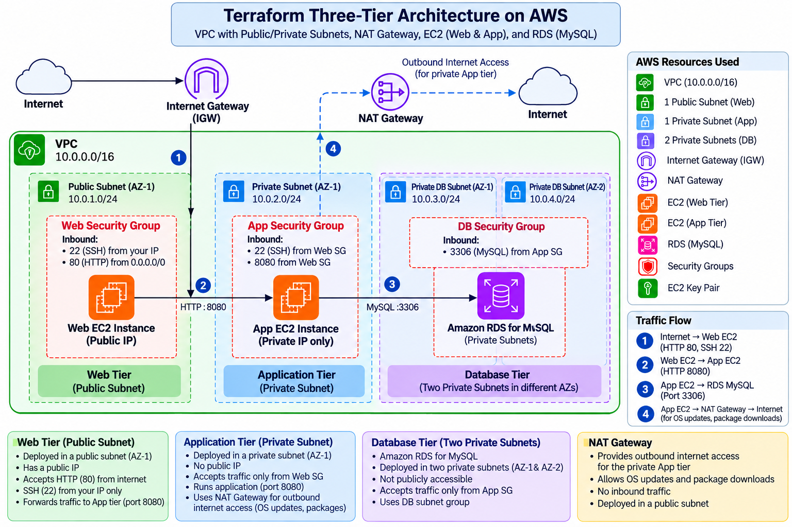

### 2. VPC Resource Map

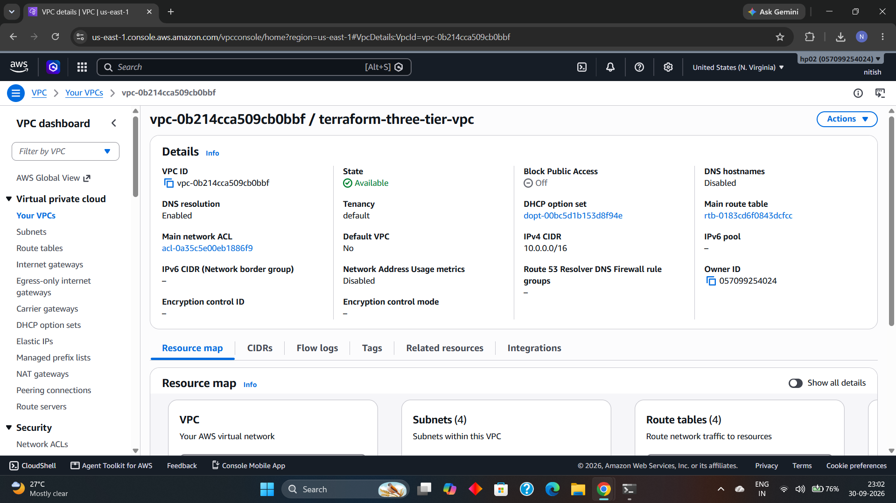

### 3. VPC Subnets

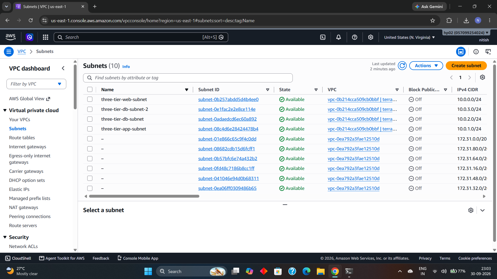

### 4. Route Tables

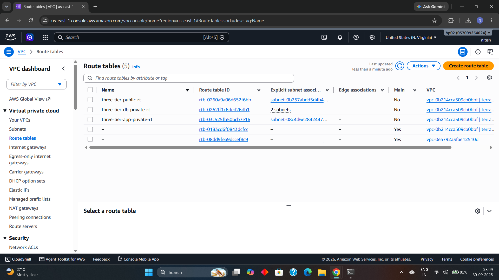

### 5. NAT Gateway

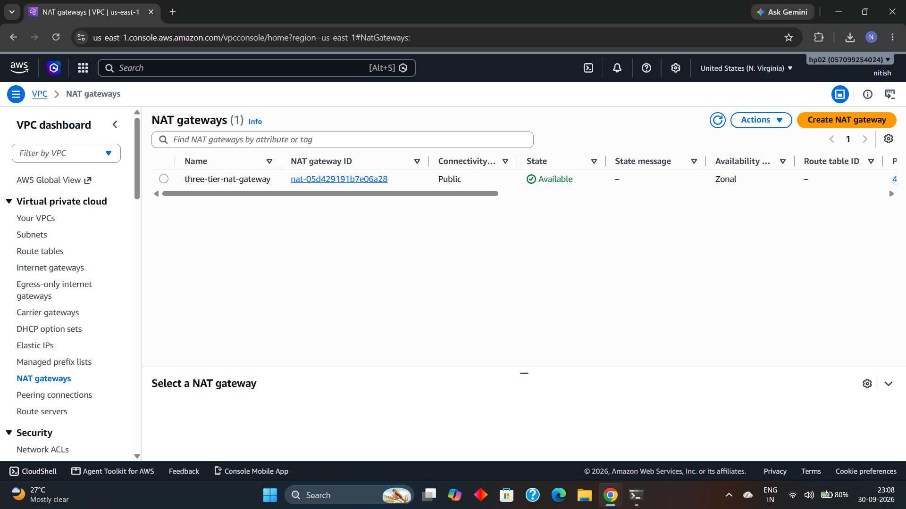

### 6. Web EC2 Instance

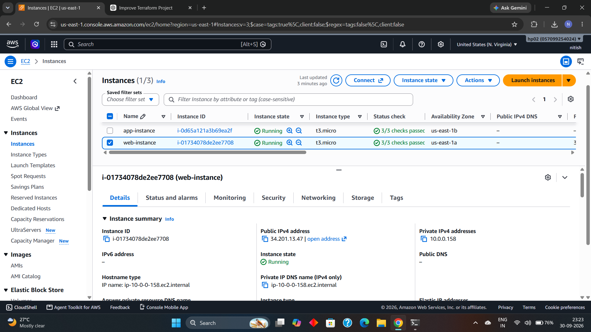

### 7. App EC2 Instance

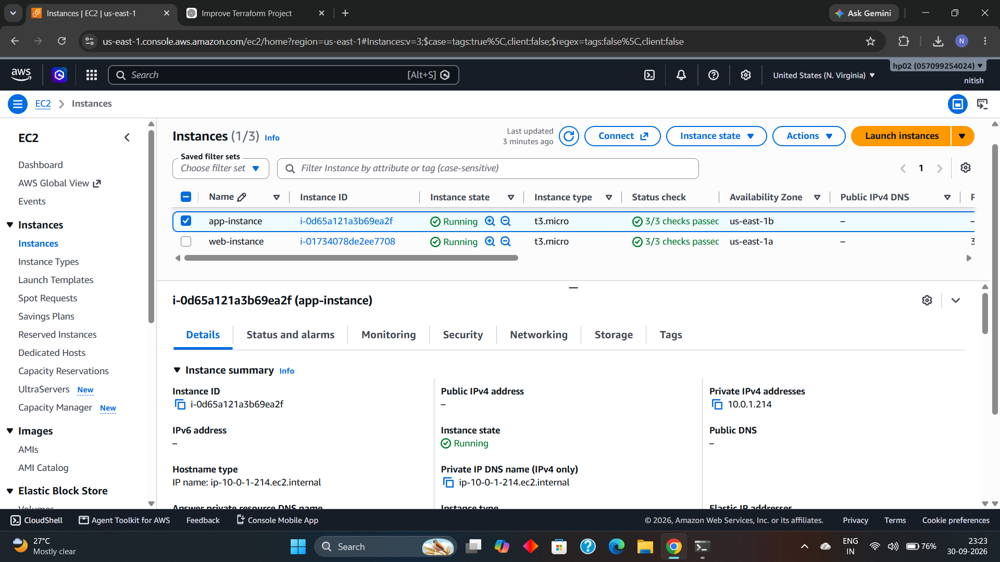

### 8. Web Security Group

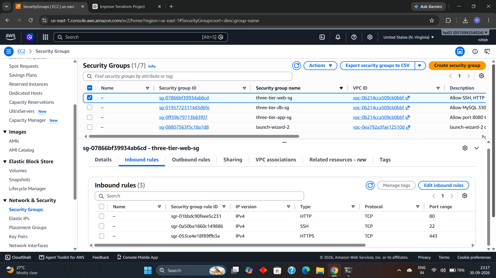

### 9. App Security Group

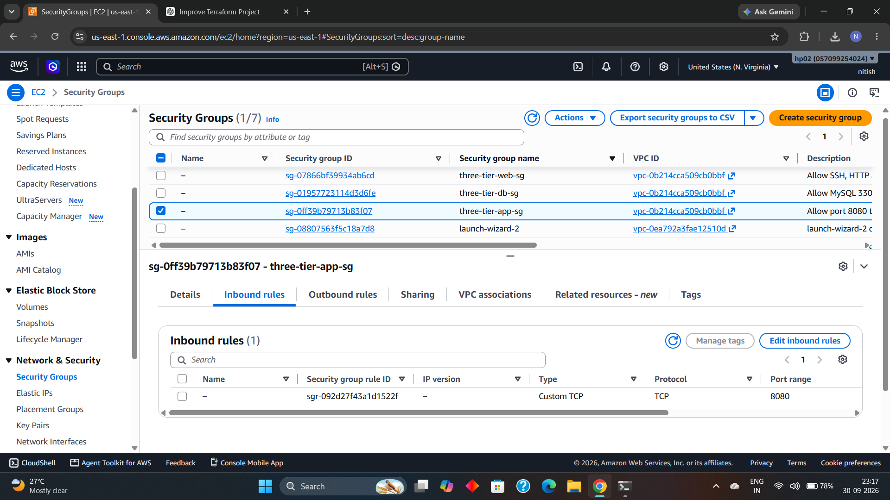

### 10. Database Security Group

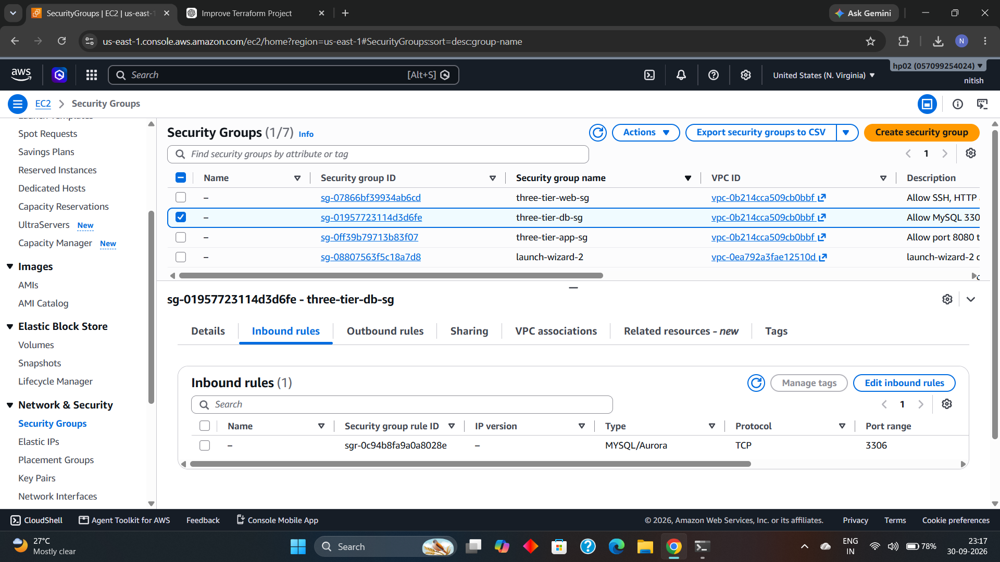

### 11. RDS Configuration

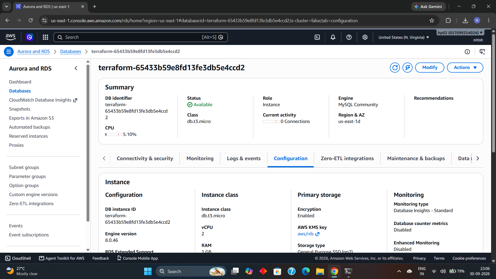

### 12. Terraform Output

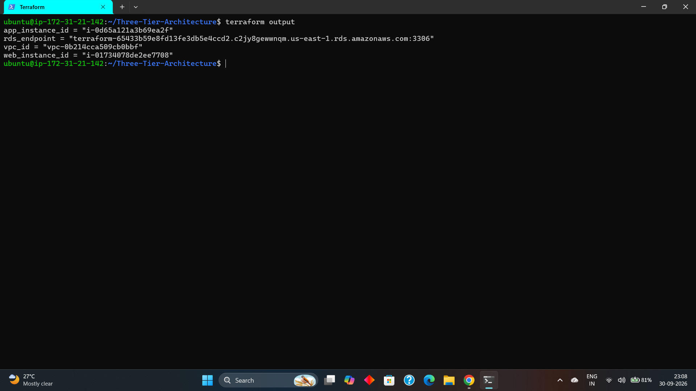

### 13. Terraform Plan

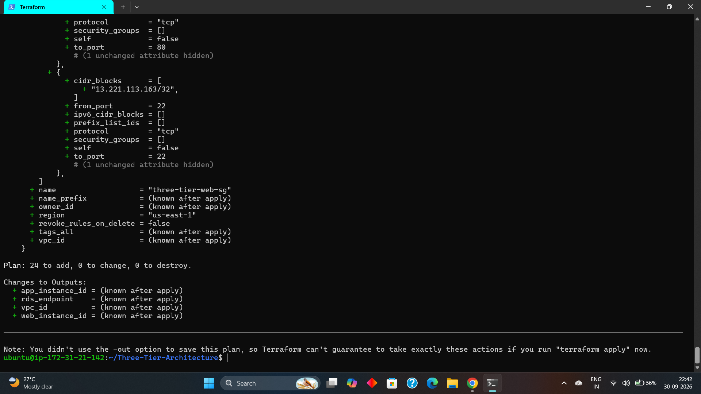

## What I Practiced

This project helped me practice:

-   Terraform configuration and workflow
-   Terraform modules
-   Variables and outputs
-   AWS provider configuration
-   VPC design
-   Public and private subnets
-   Route tables and route associations
-   Internet Gateway
-   NAT Gateway
-   Elastic IP
-   EC2 provisioning
-   Security group design
-   Security group-to-security group access
-   Amazon RDS MySQL
-   RDS subnet groups
-   Private database networking
-   Terraform validation and planning
-   Remote Terraform state with Amazon S3
-   Terraform state locking
-   Infrastructure cleanup with `terraform destroy`
-   Basic infrastructure security practices

## Important Project Scope

This project focuses on infrastructure provisioning and networking.

Terraform provisions the EC2 instances, but it does not automatically
install or deploy an application on the Web or App instances. The
security groups and network paths are configured so that an application
can be deployed on top of the infrastructure.

## Learning Outcome

The main goal of this project was to understand how a basic AWS
three-tier architecture can be represented as Infrastructure as Code
using Terraform and organized into reusable modules.

The project demonstrates the separation of:

``` text
Web Tier
   ↓
Application Tier
   ↓
Database Tier
```

while keeping the application and database tiers private from direct
internet access.

## License

This project is intended for learning and portfolio purposes.

